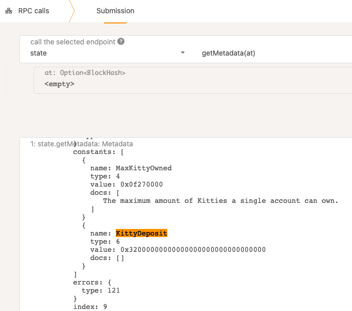
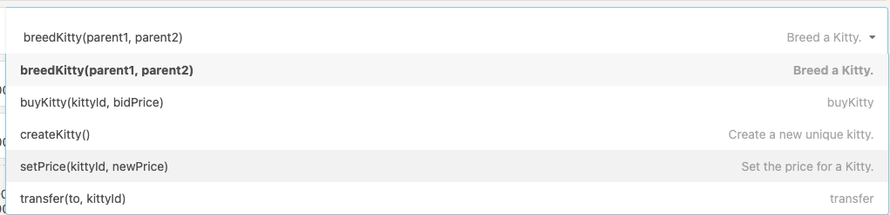
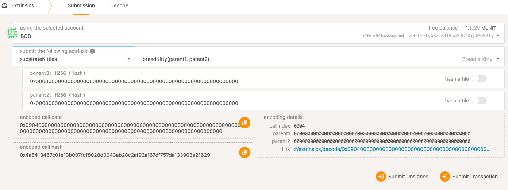
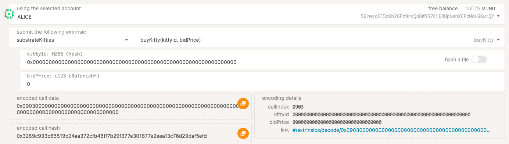
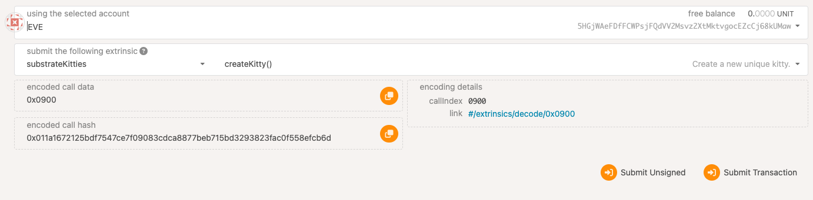
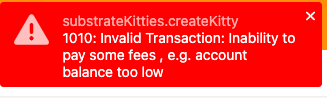

# substrate_advance_hw2

## KittyIndex实现

```Rust
let kitty = Kitty::<T> {
    dna: dna.unwrap_or_else(Self::gen_dna),
    price: None,
    gender: gender.unwrap_or_else(Self::gen_gender),
    owner: owner.clone(),
    };

let kitty_id = T::Hashing::hash_of(&kitty);
```
根据kitty的信息取哈希值作为kitty_id进行检索。

## 查询账号所有kitties的存储实现

### 声明存储

```Rust
#[pallet::storage]
    #[pallet::getter(fn kitties_owned)]
    /// Keeps track of what accounts own what Kitty. 一个账号拥有的所有kitties
    pub(super) type KittiesOwned<T: Config> =
        StorageMap<_, Twox64Concat, T::AccountId, BoundedVec<T::Hash, T::MaxKittyOwned>, ValueQuery>;
```

### 修改存储

```Rust
// Remove `kitty_id` from the KittiesOwned vector of `prev_owner`
<KittiesOwned<T>>::try_mutate(&prev_owner, |owned| {
    if let Some(ind) = owned.iter().position(|&id| id == *kitty_id) {
        owned.swap_remove(ind);
        return Ok(());
    }
    Err(())
}).map_err(|_| <Error<T>>::KittyNotExist)?;


<KittiesOwned<T>>::try_mutate(to, |vec| {
    vec.try_push(*kitty_id)
}).map_err(|_| <Error<T>>::ExceedMaxKittyOwned)?;
```

### 质押token

```Rust
let sender = ensure_signed(origin)?;
let deposit = T::KittyDeposit::get();
ensure!(T::Currency::free_balance(&sender) >= deposit, <Error<T>>::NotEnoughBalance);

// Reserve deposit example
T::Currency::reserve(&sender, deposit)?;

// Unreserve deposit example
T::Currency::unreserve(&seller, deposit);
```

## 通过polkadot js调用函数

### RPC查询的质押Kitty常量设置


### 可调用函数


### 繁殖Kitty


### 购买Kitty


### 没有token质押导致失败


